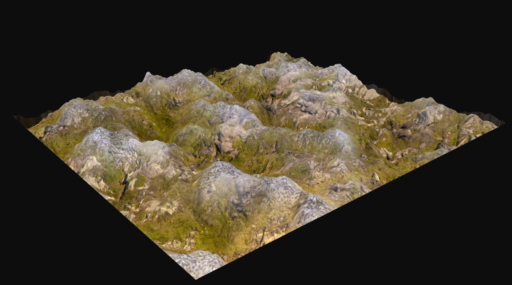
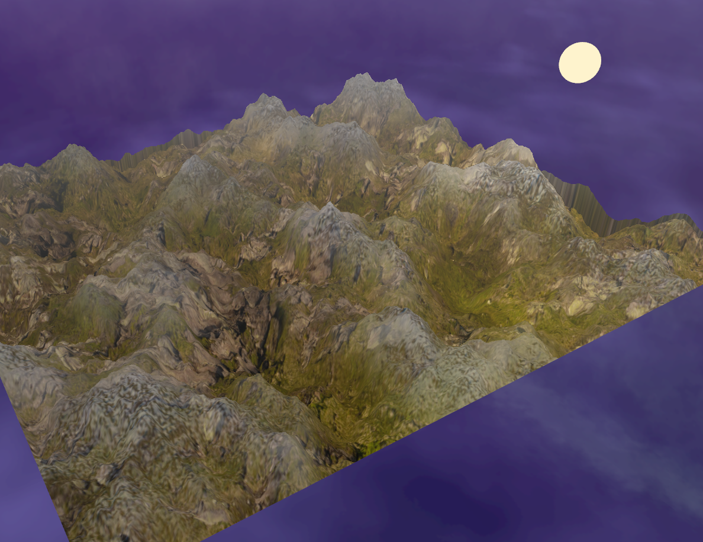

# Procedural Terrain OpenGL Demo - Acerola 2025 Dirtjam Submission
#### by Jonathan Benz

**Description:**  
My entry for the [Acerola 2025 Dirtjam](https://itch.io/jam/acerola-dirt-jam) — a procedural terrain demo built in Modern Core OpenGL using C++14 over the span of two weeks. 

---

## Features

- **Procedural Terrain Generation**
  - Heightmap generation done with random [Simplex Noise](https://github.com/SRombauts/SimplexNoise) and Fractional Brownian Motion.
  - Normal map generation done by calculating the gradients of each point of the heightmap.

- **Advanced Shading**
  - [Parallax Occlusion Mapping](https://learnopengl.com/Advanced-Lighting/Parallax-Mapping) on terrain surface to give the illusion of depth. 
  - [Blinn-Phong](https://learnopengl.com/Advanced-Lighting/Advanced-Lighting) Lighting Model.
  - Height-based snow texturing for mountain peaks.
  - Fog effect when camera is far away from the scene. 
  - Skybox [cubemap](https://learnopengl.com/Advanced-OpenGL/Cubemaps) environment.

- **Post-Processing**
  - [HDR and Tonemapping](https://learnopengl.com/Advanced-Lighting/HDR). 
  - Two-Pass Gaussian Blur for [Bloom](https://learnopengl.com/Advanced-Lighting/Bloom), using a downsampled framebuffer for increased performance. 
  - [Screen Space Lens Flare](https://john-chapman.github.io/2017/11/05/pseudo-lens-flare.html). 

---

## GIFs and Images

  
  
<em>Figure 1: Finalized Demo Scene.</em>

  
  
  
<em>Figure 2: Screen Space Lens Flare Post-Process Effect.</em>

  
  
  
  
<em>Figure 3: From left to right: Simplex Noise Visualization, Heightmap Parallax Mapped without Fractional Brownian Motion (FBM), and with FBM. With FBM, the terrain looks more rocky and mountainous when octaves are layered upon it.</em>

  
  
  
<em>Figure 4: From left to right: Terrain with base texture, and terrain with added snow texture dependent on the value of the heightmap (in TBN space) in order to achieve snowy mountain peaks. </em>

  
  
  
<em>Figure 5: From left to right: Rendering SRGB textures without <a href="https://learnopengl.com/Advanced-Lighting/Gamma-Correction" target="_blank">gamma correction</a>, versus with gamma correction. </em>

  
  
  
<em>Figure 6: From left to right: Lens Flare effect without textured sunburst, versus with a textured sunburst. </em>

  
  
<em>Figure 7: Blinn-Phong exagerrated specular shininess showcase, with bloom. </em>

---

## Potential Future Work
- **[Shadow Mapping](https://learnopengl.com/Advanced-Lighting/Shadows/Shadow-Mapping) Implementation**
  - This gets a little tricky with Parallax Mapping, since every point on the quad shares the same z-value.

- **Volumetric Clouds**
  - This is something I have never done before, but it would be interesting to learn about. 
 
